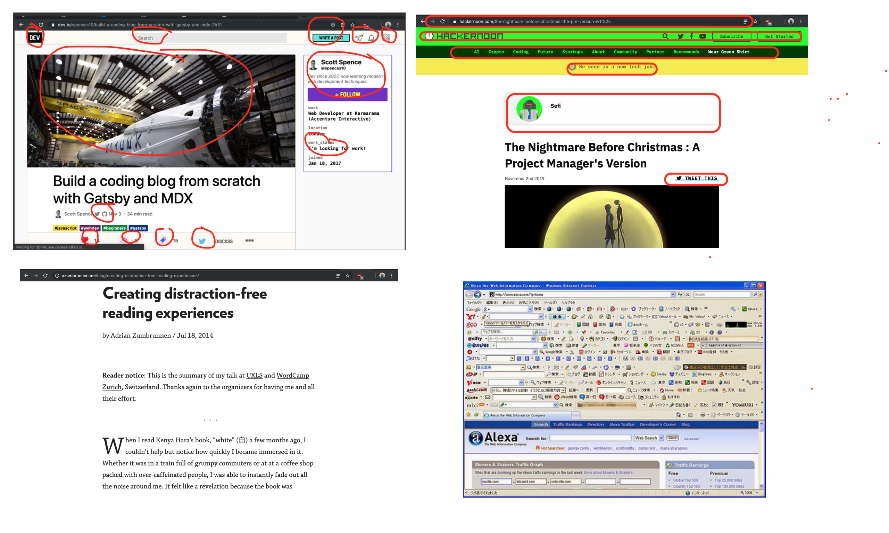

# Ritza

Every day, around 2 million new pieces of content are pushed out onto the internet.

Most of it is bad.

Companies spend billions of dollars trying to create content that will draw potential customers to their sites. Readers ignore them. Or block them.

Readers spend billions of hours trawling through increasingly bad search results, looking for the content that will help them gain new knowledge and discover new things. But more and more often, they come away disappointed. Even after going to page 2 of Google, they could only find fake news, advertising, and bad quality writing on slow loading sites full of adverts and other distractions. 

Ritza creates text-based content that people want to read. We give it to them, and then get out of their way to let them read it. Our content teaches people what they want to know. It is written by professional writers, edited by professional editors, and designed by professional designers.

It is free for everyone, shared under open licenses. It loads fast, and looks beautiful. Most importantly, it is informative and it educates people.

"Marketing" has become a dirty word, and marketing departments use dirty tactics to trick people into doing things that they do not want to do (such as drinking unhealthy, unpleasant, black liquid). 

But marketing wasn't always like this. And it doesn't have to be. Instead of using dark patterns to trick people into buying stuff that they don't want or need, marketing teams can use Ritza to give their customers what they really do want. Knoweldge.

## What makes Ritza's content different

## Created by a team of professionals
Ritza's content isn't hacked out by underpaid copywriters on tight deadlines and small budgets. Each article is the result of days or weeks of work, and a detailed creation process. From topic selection, through outlining, drafting, editing, technical checking, design, and publishing, Ritza's articles get seen by many people, and each of these people improves it. Each one of Ritza's articles aims to be in the top 0.1% of content on the web. 

## Beautiful and distraction free

Medium.com is well-known for being extremely user hostile, but even other sites which claim to have their readers' best interests at heart are not shy of ruining their content. Hackernoon has rows up rows of menus, reminiscent of browser toolbars from the 90s. Dev.to has many calls to action, trying to trick the reader into failing at their goal -- to read an article. 

Compare this to the beautiful site by Adrian Zumbrunnen. All you can see is text, because that is why you, as a reader, are there in the first place.

## Instructive

> However, people are easy-going, and they have formed the habit of reading page upon page of all sorts of such verbiage, without having any particular idea of what the author really means. They fancy it is all as it should be, and fail to discover that he is writing simply for writing’s sake. 
(Schopenhauer, [On Style](https://ebooks.adelaide.edu.au/s/schopenhauer/arthur/lit/chapter2.html))

Ritza's articles never have keyword stuffing, boring reflections, or catchy slogans. All of our content has a single purpose: to teach. And each article teaches a single concept. 

