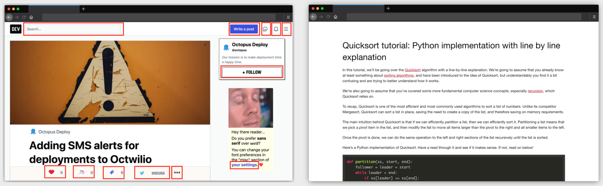

# Ritza

> Marketing as Education

We produce articles for your company's technical blog or community.

Ritza produces the internet's best articles that teach developers how to build technical solutions. See [https://ritza.co/showcase/repl.it](our showcase) for examples.

Companies use these articles to reach potential customers, either directly (by commissioning articles that teach people how to use their product) or indirectly (by hosting great technical content on their domain and ranking well on Google as a result).

Ritza offers you not only the highest quality articles, but also the simplest possible integration. You purchase a subscription to Ritza and we publish content for you every month. That's it. Behind the scenes, our writers gain a deep understanding of your product or service and write tutorials or articles on how it can be used to solve your customers' problems. Your customers find these articles through search engines or technical communities. 

## How much does it cost?

Ritza's standard package is 4000 words/month split into 1-4 articles over the month and costs $3000/month on a quarterly contract.

## How do I purchase a subscription?

We're still in closed beta. Email garethdwyer@gmail.com.

## What makes Ritza's content different?

Instead of using our services, you might choose to find a freelancer, employ a full time content writer, create an in-house content team, or contract an agency. All of these are valid options and we'll gladly refer you if they seem a better fit for your needs. 

However, we distinguish ourselves from all of these options in several ways

### Our content is created by a team of professionals

Ritza's content is created by a team of people who all have expertise in technology and writing. By contrast, most other content on the web is produced either by

a) An individual writer, often "unpolished" in terms of editing, design, and readability
b) A 'content team', usually heavy on 'content strategists', 'growth hackers', 'SEO experts', and marketing managers. Ritza takes a strong stance that most of these people do not add value to the content. Often the writer is required to work closely under the direction of these people, resulting in generic content and "fluff" pieces.

Ritza's team consists solely of craftspeople: doers, not overseers. These are people who understand the audience very well, as they are part of it. They are creating the content that they wish existed. The writer is always the main contributor to any piece of content, and is supported by editors and designers as necessary.

While many content agencies claim that their writing is produced by "experts", they often pay 1c-10c/word for this "expert created" content, with the rest of the fee being absorbed by account managers and other business focussed people. The "expert" is often someone without much expertise on the topic.

### Our content is beautiful and distraction free

A vast majority of content is cluttered and ugly. It contains many "CTAs" or "calls to action" to try to get the reader to do something (often to spend money or sign up for a mailing list). By contrast, Ritza's gives readers the content that they need and then gets out of the way. This approach does not result in an increase of "vanity metrics", but it ultimately wins the readers' respect and loyalty.

As an example, see above an article from dev.to on the left which contains no fewer than _twelve_ elements that try to convince the reader to navigate away from the page on which he or she presumably landed on with the intention of reading the article. By contrast, a Ritza article is on the right.

### Our content focuses solely on educating your readers
It sounds paradoxical, but our content works well as marketing precisely because it strives not to be marketing. We do not push readers to buy products or services (though we often demonstrate how products and services can be used to solve specific problems). Our writers' only goal is to help the reader solve problems, and that's why readers love our content.
