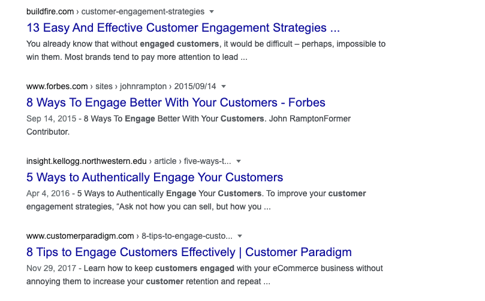

# What is engagement?

If you've ever signed up for a company newsletter, or given your email address to a company for any reason, it's fairly likely that they will have tried to "engage" with you at some point.

They might even have an entire team whose job description is: "engage better with our customers".

But what does that even mean?

The snippet that currently comes up on Google for "engage customers" is

> Customer engagement is about encouraging your customers to interact and share in the experiences you create for them as a business and a brand. When executed well, a strong customer engagement strategy will foster brand growth and loyalty

Oh yes. The 'experiences' that companies create. Right I get it. So engagement is like... wait actually I still have no idea what it means.  The author of [6 ways to engage customers without being annoying](https://www.copper.com/blog/engage-customers) (the next top hit on Google) obviously doesn't know that headlines in the pattern `x ways to do y` are pretty annoying. But maybe Brent knows what's up and I don't so I'll click on it.

Ah, the classic overlay pop up and oversized pointless cookie banner. Great. I'm feeling more and more "engaged" by the moment. Look for the x buttons. Close the overlays. Scroll past the massive header image and huuge title. Past the author's picture. Past the date. Past the first sentences which are almost always useless. Scroll scroll scroll.

> The reality, though? Engagement is both measurable and actionable.

> Well, at least it should be.

Uh, Brent. I'm not looking for a cheesy intro to a zombie movie. But I guess you're keeping me on the page so far so who am I to judge? What is engagement again? Somehow if I manage to game my metrics like bounce rate that proves I have engaged customers? Seems... not quite right.

Scroll, scroll. Way 1: "Ask more questions". Got it. I've been doing that this whole time. Am I engaging people? I thought I was just confused. Scroll scroll.

> Encourage employees to share and publish your company’s’ content

Ooh that is engaging. My employer did that once. It engaged a large amount of frustration and I promptly quit. Did I say something about gaming metrics earlier? If you have to literally buy people to "engage" with your content maybe your content isn't that "engaging". Just a thought, but what would I know.

> Customers are far more than data points; they’re people.

That seems to directly contradict your earlier point that I could just look at metrics? And I still don't understand engagement. Let's go find another article.

Skip the "x ways..." articles. Wow there are a lot of them. Let's try [this one](https://blog.smile.io/what-is-customer-engagement-and-why-is-it-important/).

> we’re going to take a look at how customer engagement is defined...

Great, that's what I want.

> "Customer engagement is the ongoing interactions between company and customer, offered by the company, chosen by the customer."

Sounds awful.

> "Customer engagement is an estimate of the degree and depth of visitor interaction against a clearly defined set of goals."

Uh? Nope, sorry you lost me.

> "Customer engagement is the degree and depth of brand-focused interactions a customer chooses to perform."

Uh, nope.

> Showing your customers that you appreciate their investment in your brand can be as simple as awarding them points each time they place an order. Polaroid Originals adds value to every order their customers place, making each of them more likely to return to make another order in the future.

WHY DO I LIVE IN THIS WORLD AND NOT A BETTER ONE WHERE THAT DOESN'T EXIST??

> Empowering your best customers to easily share your brand with their friends and family can not only help you acquire a new one, but also engage the customers you have

Noooooooooooooooooooooooooooooooooooooooo.

## /end rant (almost)

Exploring the 'customer engagement' articles didn't really answer many questions for me, but it did reinforce my opinion that 99% of marketing is complete and utter horseshit. Like the smelly, shitty kind of horse shit, not the romantic grassy smell that reminds you of nature.

If you're ever looking for examples of hypocrisy, for maybe a high school essay or something, just search for marketers talking about "treating customers as if they were human".

If you actually want customers, maybe stop trying so hard to engage with them. Give them good products or services and get out of their fucking way to let them enjoy themselves. You're not as important as you think you are and they probably don't want to engage with you.

**/end rant (for real).**

