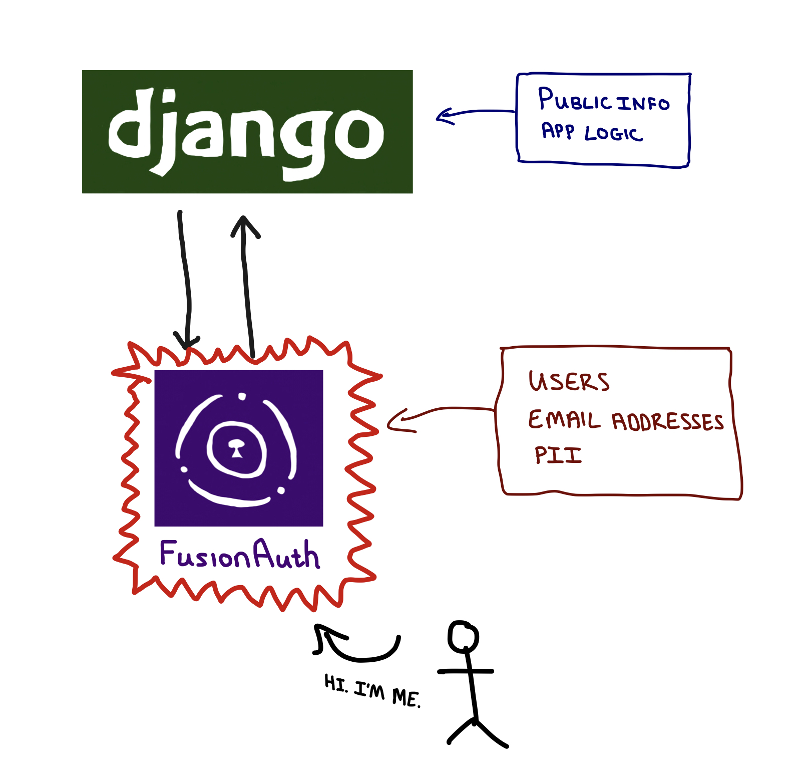
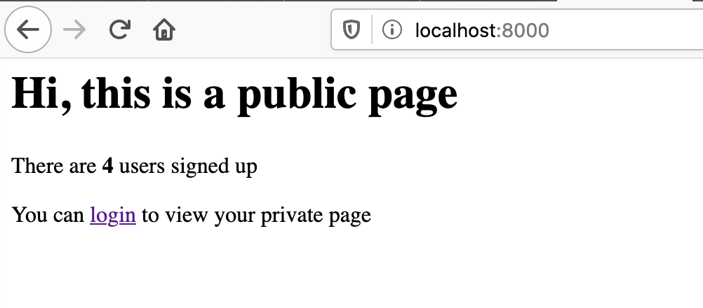
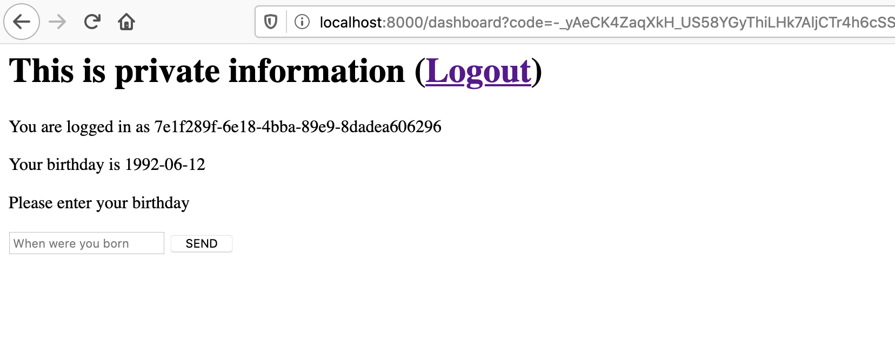

# Adding social sign in to your Django web application using Fusion Auth

In this tutorial, we'll build a basic Django web application which does user registration and authentication via [FusionAuth](https://fusionauth.io/)

## Why FusionAuth

* Django has a mature authentication system by default, but it doesn't do everything. Django-allauth adds functionality for e.g. logging in with Google. 

* But nearly every web app needs authentication. Authentication is more complicated than it seems. It's a great thing for Single Responsibility Principle - use something whose only job it is to do auth well, instead of auth being something that people who are focussing on building hte app also have to work on.



* Add more services - can easily use the same database of users - they don't need to sign up again, and if they are logged into one, they can be logged in everywhere
* Can put effort into focussing on security and compliance for the FusionAuth app and don't need to worry as much about the data in Django app.
* If we set up integrations with third party services, such as Google, we only need to do this once, instead of for each app we build.

## Setting up Fusion Auth

* Mainly link to 5 minute set up guide, but re-outline the steps more breifly here.
* Docker compose 
* Create application

## Setting up a Google sign in

* Also mainly link to existing tutorial on how to do this, with brief steps
* Sandbox account can have 100 users

## Setting up Django

* Virtualenv 
* Install
* Urls
* FusionAuth client

## Building our application

### Outline of our applicatin
* We'll build a very simple application with only three pages

1. A home page - a public page showing how many users our app has an inviting users to log in
 

2. The log in / sign up page (on FusionAuth) with options to use a username/password or to sign in with Google


3. A logged in private "dashboard" page, unique per user. This will display the user's birthday if we have it on record, or allow them to add or change their birthday. It will also let users log out.


### Adding the FusionAuth login URL
* Show how to build up the URL from client id, redirect URL etc

### Validating user logins with FusionAuth
* Show how to get the code, exchange it for an access token and explain why this is important
* User brings us the code, but it's in a public place - not secure. Our Django backend then talks directly to FusionAuth's backend to swop the code for an access token securely. If the access token checks out, we let our user access the page

### Adding the POST form 
* Get the users birthday and display it if we already have it

### Adding a logout button
* Add a logout button with a redirect
* configure the redirect in FusionAuth

### Retreiving the user's private data on log in
* Get the birthdate on log in from the user and display it

### Conclusion
* We set up a Django app with FusionAuth as our Auth server
* It's nice to not have to worry about storing private information in our main application.


```python
#views.py
import dateparser

from django.views.generic import View
from django.urls import reverse
from django.shortcuts import render, redirect
from django.contrib.auth.models import User
from django.conf import settings

from fusionauth.fusionauth_client import FusionAuthClient


def get_or_create_user(user_id, request):
    user = User.objects.filter(username=user_id).first()
    if not user:
        user = User(username=user_id)
        user.save()
    return user


def get_login_url(request):
    redirect_url = request.build_absolute_uri(reverse("dashboard"))
    login_url = f"{settings.FUSION_AUTH_BASE_URL}/oauth2/authorize?client_id={settings.FUSION_AUTH_CLIENT_ID}&redirect_uri={redirect_url}&response_type=code"
    login_url = login_url.format(
        settings.FUSION_AUTH_BASE_URL, settings.FUSION_AUTH_CLIENT_ID,
    )
    return login_url


def user_login_ok(request):
    client = FusionAuthClient(
        settings.FUSION_AUTH_API_KEY, settings.FUSION_AUTH_BASE_URL
    )
    code = request.GET.get("code")
    if not code:
        print("no code")
        return False
    try:
        redirect_url = request.build_absolute_uri(reverse("dashboard"))
        r = client.exchange_o_auth_code_for_access_token(
            code,
            redirect_url,
            settings.FUSION_AUTH_CLIENT_ID,
            settings.FUSION_AUTH_CLIENT_SECRET,
        )

        if r.was_successful():
            access_token = r.success_response["access_token"]
            user_id = r.success_response["userId"]
            get_or_create_user(user_id, request)
            return user_id
        else:
            print(r.error_response)
            return False
    except Exception as e:
        print(e)


class HomeView(View):
    def get(self, request):
        num_users = User.objects.count()
        login_url = get_login_url(request)
        return render(
            request,
            "fusiondemoapp/home.html",
            {"login_url": login_url, "num_users": num_users},
        )


class DashboardView(View):
    def get(self, request):

        if not user_login_ok(request):
            login_url = get_login_url(request)
            return redirect(login_url)

        user = None
        try:
            client = FusionAuthClient(
                settings.FUSION_AUTH_API_KEY, settings.FUSION_AUTH_BASE_URL
            )
            r = client.retrieve_user(request.user.username)
            if r.was_successful():
                user = r.success_response
                birthday = user["user"]["birthDate"]
            else:
                print(r.error_response)
        except Exception as e:
            print("couldn't get user")
            print(e)

        return render(request, "fusiondemoapp/dashboard.html", {"birthday": birthday})

    def post(self, request):

        birthday = request.POST.get("birthday")
        normalised_birthday = None
        print(birthday)

        try:
            dt = dateparser.parse(birthday)
            normalised_birthday = dt.strftime("%Y-%m-%d")
        except Exception as e:
            print(e)
            print("Couldn't parse birthday")

        if not normalised_birthday:
            return render(
                request,
                "fusiondemoapp/dashboard.html",
                {"message": "Couldn't parse birthday. Please use YYYY-MM-DD"},
            )

        try:
            client = FusionAuthClient(
                settings.FUSION_AUTH_API_KEY, settings.FUSION_AUTH_BASE_URL
            )
            r = client.patch_user(
                request.user.username, {"user": {"birthDate": normalised_birthday}}
            )
            if r.was_successful():
                print(r.success_response)
                return render(
                    request,
                    "fusiondemoapp/dashboard.html",
                    {
                        "message": "Updated your birthday",
                        "birthday": normalised_birthday,
                    },
                )
            else:
                print(r.error_response)
                return render(
                    request,
                    "fusiondemoapp/dashboard.html",
                    {"message": "Something went wrong"},
                )
        except Exception as e:
            print(e)
            return render(
                request,
                "fusiondemoapp/dashboard.html",
                {"message": "Something went wrong"},
            )


class LogoutView(View):
    def get(self, request, *args, **kwargs):
        redirect_url = request.build_absolute_uri("home")
        url = f"http://localhost:9011/oauth2/logout?client_id=54a89ede-2c09-4f76-8050-7249ce350a5c"
        return redirect(url)
```


```html
<!-- home.html -->
<html>
    <head>
        <title>My Django Application</title>
    </head>

    <body>
        <h1>Hi, this is a public page</h1>
        <p> There are <b>{{num_users}}</b> users signed up </p>
        <p>You can <a href="{{login_url}}">login</a> to view your private page</p>
    </body>
</html>
```

```html
<!-- dashboard.html -->
<html>
    <head>
        <title>SUPER PRIVATE INFO!!</title>
    </head>

    <body>
        <h1>This is private information (<a href="/logout">Logout</a>)</h1>
        <p>You are logged in as {{request.user.username}}</p>
        
            <font color="red">
                <h3>{{message}}</h3>
            </font>
        
        <p>Your birthday is {{birthday}}</p>
        <p>Please enter your birthday</p>
        <form action="/dashboard" method="POST">
            
            <input type="text" name="birthday" placeholder="When were you born">
            <input type="Submit" value="SEND">
        </form>
    </body>
</html>
```


            


