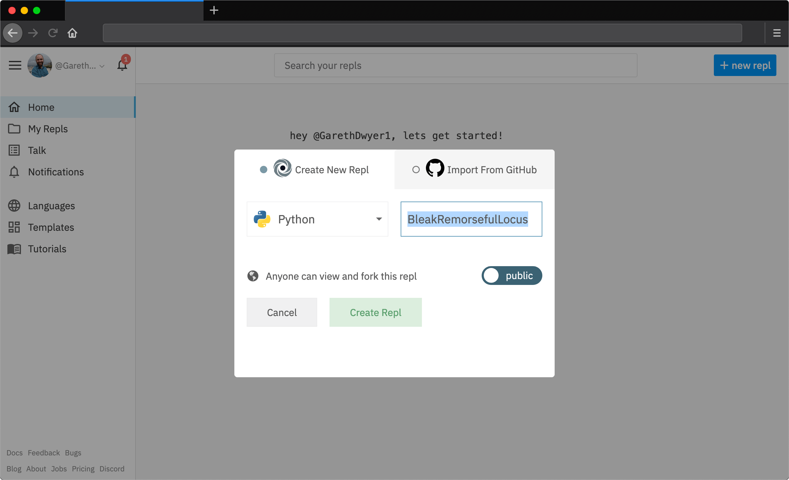
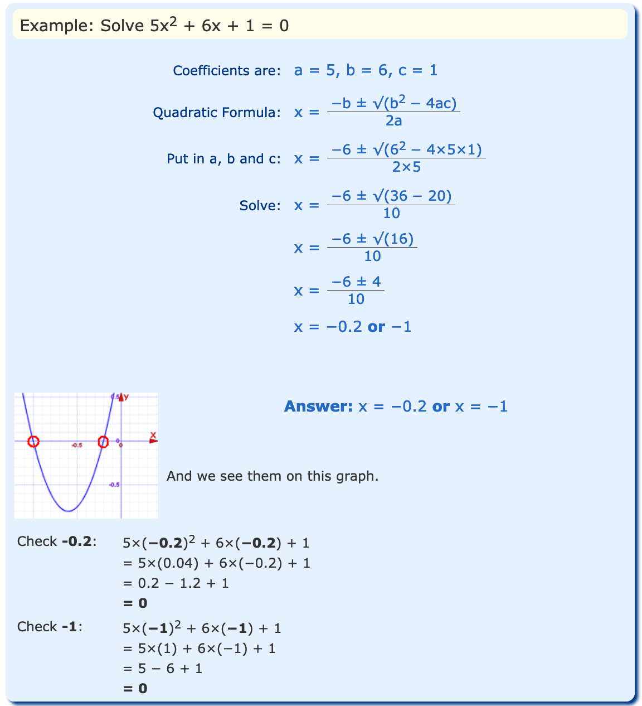
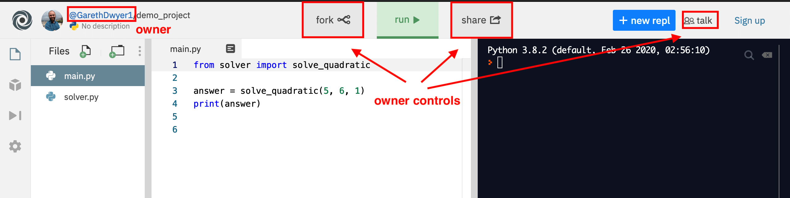
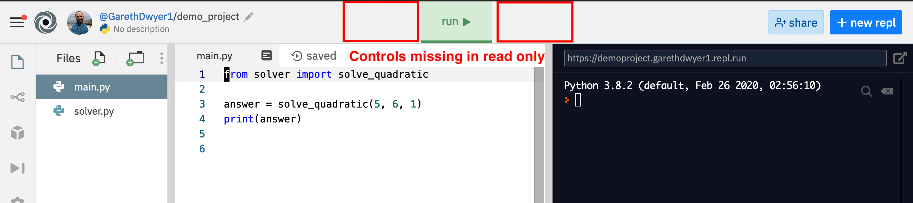
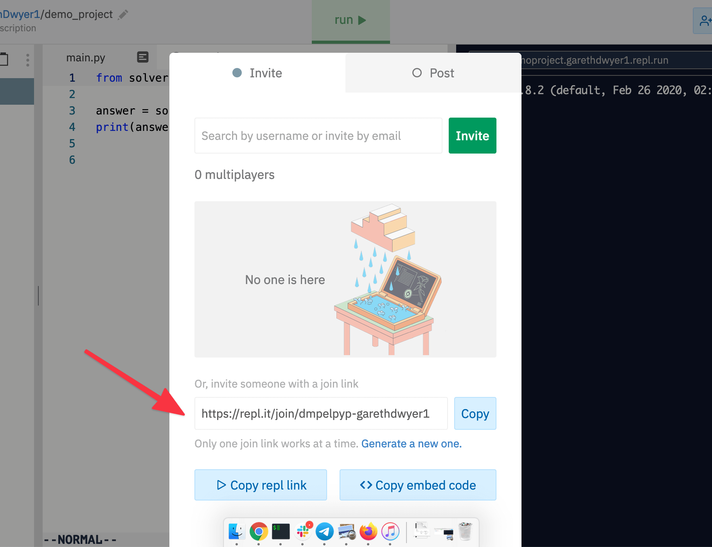

# Understanding the Repl.it IDE: a practical guide to building your first project with Repl.it

Software developers can get pretty attached to their Integrated Development Environments (IDEs) and if you look for advice on which one to use, you'll find no end of people advocating strongly for one over another. VS Code, Sublime Text, IntelliJ, Atom, Vim, Emacs, and no shortage of others.

In the end, an IDE is just a glorified text editor. It lets you type text into files and save those files, functionality that has been present in nearly all computers since those controlled by punch cards.

In this guide, we'll show you how to use the Repl.it IDE. It has some features you won't find in many others, namely:

* It's fully online. You can use it from any computer that can connect to the internet and run a web browser, including a phone or tablet.
* It'll fully manage your environment for building and running code too: you won't need to mess around with making sure you have the right version of Python or the correct NodeJS libraries.
* You can deploy any code you build to the public in one click too: no messing around with servers, or copying code around.

In the first part of this guide, we'll cover the basics and also show you how multiplayer works so that you can code alone or with friends.

## Introduction: creating an account and starting a project

Although you don't need an account to use Repl.it (you can just navigate to [repl.it](repl.it) and press the "start coding" button), we'll set one up in order to have access to all of the features.

Visit [https://repl.it/signup](https://repl.it/signup) and follow the prompts to create a user account, either by entering a username and password or logging in with Google, GitHub, or Facebook.

Once you're done, hit the "+ new repl" button in the top right. In the example below, I'm choosing to create a new Python project. Repl.it will automatically choose a random name for your project, or you can pick one yourself. Note that by default your repl will be public to anyone on the internet: this is great for sharing and collaboration, but we'll have to be careful to not include passwords or other sensitive information in any of our projects.



You'll also notice an "Import from GitHub" option. Repl.it allows you to import existing software projects directly from GitHub, but we'll create our own for now. Once your project is created, you'll be taken to a new view with several panes. Let's take a look at what these are.

### Understanding the Repl.it panes

You'll soon see how configurable Repl.it is and how most things can be moved around to your fancy. However, by default, you'll get the following layout.


1. **Left pane: files and configuration.** This, by default, shows up all the files that make up your project. Because we chose a Python project, Repl.it has gone ahead and created a `main.py` file there already
2. **Middle pane: code editor.** You'll probably spend most of your time using this pane. It's a text editor where you can write code. In the screenshot, I've added two lines of Python code, which we'll run in a bit.
3. **Right pane: output sandbox.** This is where you'll see your code in action. All output that your program produces will appear in this pane, and it also acts as a quick sandbox to run small pieces of code, which we'll look at more later.
4. **Run button.** If you click the big green run button, your code will be executed and the output will appear on the right.
5. **Menu bar.** This lets you control what you see in the main left pane (pane 1). By default, you'll see the files that make up your project but you can use this bar to view other things here too by clicking on the various icons. We'll take a look at these options later too.

Don't worry too much about all of the functionality offered right away. For now, we have a simple goal: write some code and run it.

### Running code from a file

Usually, you'll enter your code as text in a file, and run it from there. Let's do this now. Enter the following code in the middle pane (pane 2), and hit the run button.

```python
print("Hello World")
print(1+2)
```


Your script will run and the output it generates will appear on the right pane (pane 3). Our code output the phrase "Hello World" (it's a long-standing tradition that when you learn something new the first thing you do is built a 'hello world' project), and then output the answer to the sum `1 + 2`.

You probably won't be able to turn this script into the next startup unicorn quite yet, but let's keep going.

### Running code from Repl.it's REPL

In computer programming, a REPL is a [read-eval-print loop](https://en.wikipedia.org/wiki/Read%E2%80%93eval%E2%80%93print_loop), and a REPL interface is often the simplest way to run short computer programs (and where Repl.it got its name).

While in the previous example we saved our code to a file and then executed the file, it's sometimes quicker to execute code directly.

You can type code in the right-hand pane (pane 3) and press the "enter" key to have it run. Take a look at the example below where we print "Hello World" again and do a different sum, without changing our code file.


This is useful for prototyping or checking how things work, but for any serious program you write you'll want to be able to save it, and that means writing the code in a file like in our earlier example.

## Adding more files to your software project

If you build larger projects, you'll want to use more than a single file to help stay organised, grouping related code in different files.

So far, we've been using the 'main.py' file that was automatically created for us when we started the project, but we're not limited to this file. Let's add a new file, write some code in that, and import it into the main file for use.

As an example, we'll write code to solve [quadratic equations](https://www.mathsisfun.com/algebra/quadratic-equation.html). If you've done this before, you'll know it can be tedious without a computer to go through all of these steps.



Let's make Python do the repetitive steps for us by creating a program called "solver". This could eventually have a lot of different solvers, but for now we'll just write one: `quadratic_solver`.

Add a new file to your project by clicking on the new file button, as shown below. Call the file `solver.py`. You now have two files in your project: `main.py` and `solver.py`. You can switch between them by clicking on them.


Open the `solver.py` file and add the following code to it.

```python
import math

def solve_quadratic(a, b, c):
    """Does not solve all quadratic equations"""
    d = (b ** 2) -4 * a * c
    s1 = (-b+math.sqrt((b**2)-(4*(a*c))))/(2*a)
    s2 = (-b-math.sqrt((b**2)-(4*(a*c))))/(2*a)
    return s1, s
```

Note that this won't solve all quadratic equations as it doesn't handle cases where `d`, the discriminant, is `0` or negative. However, it'll do for now.

Navigate back to the `main.py` file. Delete all the code we had before and add the following code instead.

```python
from solver import solve_quadratic

answer = solve_quadratic(5, 6, 1)
print(answer)
```

Note how we use Python's import functionality to import the code from our new solver script into the `main.py` file, from where we can run it. Python looks for `.py` (Python) files automatically, so you omit the `.py` suffix when importing code. Here we import the `solve_quadratic` function (which we just defined) from the `solver.py` file.

Run the code and you should see the solution to the equation, as shown below.


Congratulations! You've written your first useful program.

## Sharing your application with others

Coding is more fun with friends or as part of a team. If you want to share your code with others, it's as easy as copying the URL and sending it. In my case, the URL is `https://repl.it/@GarethDwyer1/demoproject`, but yours will be different based on your Repl.it username and the project name you chose.

You can copy the link and open it in an incognito tab (or a different web browser) to see how others would experience your project if you were to share it. By default, they'll be able to see all of your files and code and run it, but not make any changes. If someone else tries to make changes to your repl, it'll automatically get copied ("Forked") to their account, or an anonymous account if they haven't signed up for Repl.it. Any changes your friends make will only happen in their copies, and won't affect your code at all.

To understand this, compare the three versions of the same repl below.

* As you see it, with all of the controls
* As your friend would see it, a read-only version
* As your friend would see it after forking it, on an anonymous account






What does this mean? Because no one else can edit your repl, you can share it far and wide. But because anyone can _read_ your repl, you should be careful that you don't share anything private or secret in it.

## Sharing write-access: Multiplayer

Of course, sometimes you might _want_ others to have write-access to your repl so that they can contribute, or help you out with a problem. In this case, Repl.it's multiplayer functionality is your friend.

If you invite someone to your repl, it's different from sharing the URL with them. You can invite someone by clicking "Share" in the top right and sending them the secret link that starts with "https://repl.it/join".



If you have a friend handy, send it to them to try it out. If not, you can try out multiplayer anyway using a separate incognito window again. Below I have my main Repl.it account on the left and a second account which opened the multiplayer invite link on the right. As you can see, all keystrokes can be seen by all parties in real-time.


## Where next?

We covered the basics of Repl.it in this guide, showing you how to create basic coding projects on your own or with friends.

Repl.it has more advanced functionality too. In future guides, we'll cover things like building and hosting web applications, installing third-party libraries, and importing code from GitHub.


