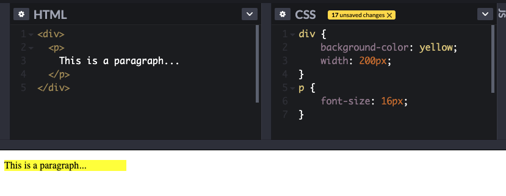
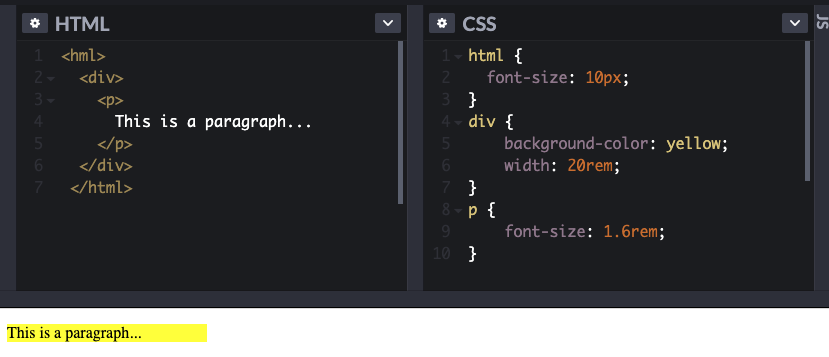
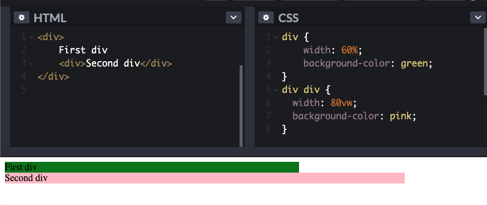

# Coding concepts for no-code builders: Understanding sizing in CSS

It's useful to understand **coding concepts** even if you're not a coder. For example, when using a no-code tool like [Bildr](https://bildr.com), it’s useful to understand how **css sizing** works. When you set the size of elements, text, or borders, you’ll set the value of the size (e.g. 12), but also **how** the size is defined, for example using `px`, `rem`, or `%`.

There are several different options to use for sizing elements, each with their pros and cons, and often the “best” solution differs depending on what you are trying to achieve for each project. A good approach is to understand the use cases for each sizing unit so that you can decide on the best option for your project.

For example, when building something like a blog post, you may want to set the heading to be larger than the body of the text, a square image of a specific size, and equal spacing between your paragraphs. If you have used something like Microsoft Word before, you may have set your headings to 18pt, the font size to 11pt, your paragraph spacing to 10pt and your images to 5x5 inches. When building a website you may have far more options presented than this. Let’s take a look at what some of these mean and how you can choose **which sizing framework to use for your project.**

## TL;DR

* If you're working on a proof of concept or building a project only for your own use, you might find `px` (pixels) the most intuitive option and the easiest to use. However using `px` has big implications for **accessibility** (e.g. supporting your users with vision difficulties) and won't handle responsiveness (e.g. mobile screens and different window sizes) well.
* For anything more serious, you should learn how to use the slightly more complicated `rem` and `em` sizing options. These define sizes in relative and more fluid ways, making them more powerful.

## Understanding absolute and relative units

Generally, CSS sizing is split into two categories, namely absolute and relative units. 

**Absolute units** are not flexible. There are a number of different options, the most popular being pixels. Should you set the font size to 16px for example, this would not change whether you were viewing the text on a PC versus a mobile device. This is useful for when the output environment is known and you wish for the element to be displayed exactly the same size, regardless of the screen it’s being viewed on. While this gives you control of each element size, it can be tedious to go back and change every element size individually should you wish to update the design for a different screen size or change the font size for example.

**Relative unit** sizing is useful for designing and building responsive pages that adjust based on screen size or user settings. Margins, padding, etc. would also scale up relative to the user settings so that your page layout would remain consistent. Relative units are dependent         on another elements’ specified size, such as the root element (HTML element).  A common example of this would be setting your HTML element’s pixel value equal to 10px so that 1 REM equals 10px. We will look at an example of this shortly. 

## When should I use absolute units and relative units?

If you’re looking for something as **intuitive and basic** as possible, go with pixel-based sizing (px). Pixels are straight-forward and specify the exact number of pixels (height & width) that your element will take up. In the example below, the 
 would have a set width of 200px, a paragraph with a font size of 16px, and a background-color of yellow. If we wanted to make the font size bigger for example, we could simply specify the font-size to be 20px. 

If [accessibility](https://developer.mozilla.org/en-US/docs/Learn/Accessibility/What_is_accessibility) is important to your project, pixels should mainly be used only for images and borders, as setting font size in pixels does not allow for users to manually set their preferred font size on their browsers. It also does not scale well on different screen sizes.  

If you’re building an element that needs to be **responsive to different screen sizes and user settings**, you have a few different options to choose from. EM and REM are both commonly used for setting font sizes, headings, margins, and padding. As discussed with relative sizing, we can set up our code to adapt to different screen sizes. For example, in the case that we set our HTML font-size to 10px, we can specify the size of our elements in REM as follows and it will still calculate to a font-size of 16px:

EM and REM (**R**elative **EM**) units are relatively similar, but REM is more commonly used. A consideration when using EM is inheritance. Font size can get progressively larger with successive nesting since each nested element is a factor of its parent elements’ size. REM, on the other hand, is only relative to the root HTML element size, so it will not cause unexpected behavior when nesting different elements. You can see an example of this below for an HTML font size of 36px. If you want to play with some real code, take a look at the working example [here](https://codepen.io/abdulqudus001/pen/rNORJYo).

Percentage-based sizing is great for **defining layouts** and is especially useful because it allows for a **relative reduction of nested child components**. Percentages are always relative to their parent component. This means that when we want to change the parent’s width, all its children will still behave in the same way.  Since we can assume that almost all browsers set a default font size of 16px, it’s become increasingly popular to set the font-size of the HTML element to 62.5%, which gets you to a 10px base font-size that respects the browser settings and makes the application more accessible. In the example below, the second div is 50% of the width of the first div (which is 60% of the current page width). This means that the second div is equal to 30% of the page width. This would automatically adjust accordingly to fit any size screen.  

In web development, the **viewport** refers to the visible part of the web page, and is affected by e.g. the user resizing their browser window. Viewport units (VH and VW) are **relative to the user’s current browser window**. This is useful for [responsive typography](https://css-tricks.com/viewport-sized-typography/) and does not rely on the parent element or root element font size. Note that VH and VW do not inherit from their parent elements and are always only relative to the current viewport size. Using an example similar to the one above, we can see that the second div is not relative to the first div when using VW, but rather to the size of the entire viewport. Setting the second div’s width to 80vw thus displays as 80% of the viewport total width.   

There are [many more sizing options](https://www.w3schools.com/cssref/css_units.asp) for setting the height and width of your elements. The examples covered above are some of the most commonly used at the moment with good reason and will not let you down. However, sizing units are a regularly debated topic amongst even experienced developers and many people tend to find their own preferred combination after some experimentation. 

